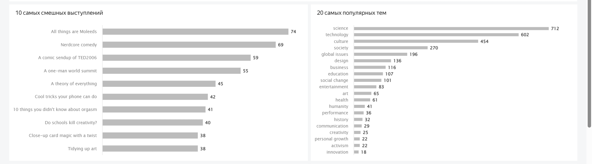

# ted-conferences-dashboard  

## 📊 О проекте

Аналитический дашборд, разработанный для компании, которая приобрела лицензию на проведение конференций в духе TED. Заказчику важно организовать первое мероприятие с учётом лучших практик прошлых конференций: подобрать актуальные темы, интересных спикеров и оптимальный формат.

Дашборд построен на основе открытых данных о выступлениях TED и позволяет ответить на ключевые вопросы:
- Какие темы сейчас популярны и как на них реагирует аудитория?
- Сколько выступающих обычно участвует в одной конференции?
- Какова оптимальная длительность выступления?
- Кто из спикеров вызывает наибольший интерес?
- Какие теги и темы собирают больше всего просмотров и смеха?

**Ключевая особенность:** все аналитические срезы реализованы на **единой странице**. Детализация обеспечивается за счёт использования **иерархических таблиц** (drill down) и системы фильтров. Это позволяет последовательно углубляться в данные от общего уровня (страны) к конкретным конференциям и выступлениям, не теряя контекста.

## 📁 Структура данных

Дашборд построен на трёх связанных таблицах, описывающих конференции, выступления и спикеров.

## 📈 Дашборд: функциональность и визуализации

Дашборд выполнен на **одной странице**, что обеспечивает компактность и удобство анализа. Все элементы (карточки метрик, сводные таблицы, графики и фильтры) расположены на едином холсте.

### 1. Верхнеуровневые показатели
В верхней части расположены ключевые метрики, дающие общее представление о данных:
- **Количество конференций** (включая те, по которым нет выступлений — учтено через `LEFT JOIN`).
- **Количество выступлений**.
- **Уникальное количество выступающих**.
- **Количество уникальных тегов**.

### 2. Детализация по конференциям (таблица с иерархией)
Центральный элемент страницы —  таблица, реализующая иерархию **«Страна → Конференция»**.  
Пользователь может раскрывать строку страны и видеть детальные данные по каждой конференции, а также сворачивать обратно.

Для каждого уровня рассчитываются следующие показатели:
- **Средняя длительность выступления** (мин).
- **Максимальное количество просмотров** 
- **Суммарное количество аплодисментов** 
- **Количество выступающих**.

Такая иерархия позволяет быстро сравнивать страны и находить самые успешные конференции внутри каждой страны.

### 3. Анализ выступлений и спикеров
Под таблицей размещены дополнительные визуализации, отвечающие на конкретные вопросы заказчика:
- **Топ-10 самых смешных выступлений** (линейчатая диаграмма).
- **Топ-20 самых популярных тегов** (линейчатая диаграмма).
- **Род деятельности выступающих, которым больше всего аплодируют** (линейчатая диаграмма).
- **Топ-10 выступающих по числу аплодисментов** (таблица).

### 4. Детальная информация о выступлении
Под графиками расположена детальная сводная таблица всех выступлений со следующими полями:  
- Страна.
- Название конференции
- Название выступления (гиперссылка на `url`).
- Тема.
- Дата записи выступления.
- Длительность.
- Количество просмотров, смеха, аплодисментов.
- Язык выступления.

Таблица поддерживает:
- **Сортировку** по любому столбцу.
- **Синхронизацию с фильтрами:**

### 5. Система фильтров
Для управления всем дашбордом предусмотрены селекторы, которые влияют на **все элементы страницы**:
- 🌍 **Страна** проведения конференции.
- 🏛 **Название конференции** (зависит от выбранной страны).
- 🏷 **Тема** выступления.
- 📅 **Диапазон дат** записи.

Благодаря единой странице и фильтрам пользователь может быстро сужать выборку до интересующего сегмента и сразу видеть, как меняются показатели.

## 🖼 Скриншот

*Верхнеуровневые метрики и таблица*  

*Анализ выступлений*  

*Детальная информация по выступлениям и спикерам*  

## 🔗 Ссылка на дашборд

👉 **[Открыть интерактивный дашборд в Yandex DataLens](https://datalens.yandex/pmihrx1swc58a)**  
*Для просмотра регистрация не требуется.*

## 🛠 Инструменты и технологии

- **Yandex DataLens** — построение дашборда, расчёт метрик, иерархические таблицы, перекрёстная фильтрация.
- **SQL** (подготовка данных, агрегации, соединение таблиц).
- **Источник данных:** агрегированный датасет выступлений TED (три связанные таблицы).

## 🚀 Как использовать

1. Перейдите по [ссылке на дашборд](https://datalens.yandex/pmihrx1swc58a)
2. Используйте фильтры в верхней части дашборда для выбора интересующих параметров (страна, конференция, тег, дата).
3. В таблице кликните на название страны, чтобы раскрыть список конференций этой страны.
4. Для поиска конкретного выступления используйте систему фильтров.
5. При необходимости сортируйте таблицы, кликая на заголовки столбцов.

## 💡 Инсайты, найденные в данных

В процессе анализа удалось выявить несколько интересных закономерностей:
- Выступления с тегом *"science"*, *"technology"* и *"culture"* являются самыми популярными темами для выступлений.
- Среди профессий спикеров лидерами по аплодисментам являются *journalist*, *artist* и *writer*.
- Самым популярным является выступление, которое прошло во время конференции TED2006 (United States), оно набрало 72 210 362 просмотров.
